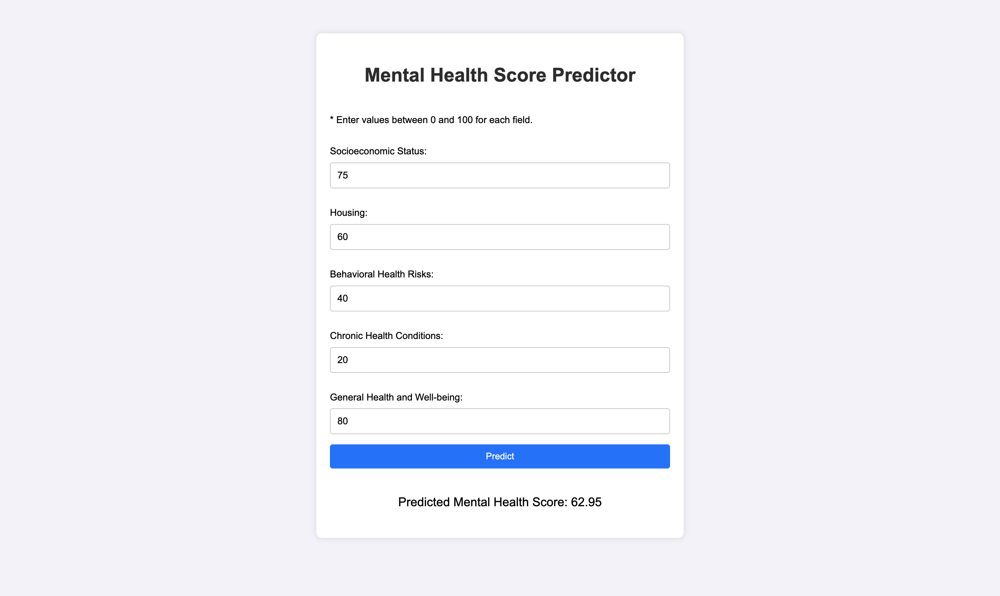

# Mental Health Score Predictor using MHAPNet

### 🖥️ [View Repository](https://github.com/tej-kodur/Mental-Health-Score-Predictor)

## 🌟 Overview  
**Mental Health Score Predictor** is a web application designed to predict an individual's mental health score based on five key parameters:
1. Socioeconomic Status  
2. Housing  
3. Behavioral Health Risks  
4. Chronic Health Conditions  
5. General Health and Well-being  

The application employs a pre-trained novel neural network model named MHAPNet to calculate the mental health score, offering a seamless interface for users to input their data and receive a prediction instantly.  

---

## 🚀 Features  
- **User-Friendly Web Interface**: Built with HTML, CSS, and JavaScript for simplicity and responsiveness.  
- **Real-Time Predictions**: Backend powered by Flask and a pre-trained PyTorch model to deliver predictions instantly.  
- **Scalable Architecture**: Modular design with reusable components for easy maintenance and scaling.  
- **Input Validation**: Ensures users provide valid inputs (whole numbers between 0 and 100).  

---

## 📂 File Structure  

``` plaintext
MentalHealthScorePredictor/
│
├── app/
│   ├── __init__.py        # Initializes the Flask app
│   ├── routes.py          # Defines application routes and logic
│
├── models/
│   ├── mental_health_predictor.pkl  # Pre-trained novel neural network model (saved with Dill)
│   ├── scaler.pkl                   # StandardScaler for input normalization
│
├── static/
│   ├── css/
│   │   ├── style.css        # Styles for the web interface
│   ├── js/
│       ├── script.js        # Client-side logic for handling predictions
│
├── templates/
│   ├── index.html           # Main HTML template
│
├── requirements.txt         # List of Python dependencies
├── run.py                   # Main script to start the Flask app
├── README.md                # Project documentation (you're reading this!)
```
---

## ⚙️ Technologies Used  

### Frontend  
- **HTML**: Structure of the web interface.  
- **CSS**: Styling for a clean, modern look.  
- **JavaScript**: Handles user interaction and AJAX requests.  

### Backend  
- **Flask**: Web framework for routing and backend logic.  
- **PyTorch**: Machine learning framework for the trained model.  

### Tools for MMHAPNet  
- **PyTorch**: Deep learning framework used to build and train the MHAPNet model.  
- **NumPy**: For data manipulation and numerical operations.  
- **Matplotlib**: Used for visualizing feature importance during model evaluation.  
- **Scikit-learn**:  
  - Data preprocessing using `StandardScaler`.  
  - Train-test split and evaluation metrics.  

### Model Serialization  
- **Dill**: For saving and loading the trained PyTorch model efficiently.  

---

## 🛠️ Installation  

### Prerequisites  
- Python 3.8+  
- Flask  
- PyTorch  
- Dill 
- NumPy

1. **Clone the Repository**  
   ```bash
   git clone https://github.com/tej-kodur/Mental-Health-Score-Predictor.git
   cd Mental-Health-Score-Predictor
   ```
2. **Create a Virtual Environment**  
    ```bash
    python -m venv .venv
    source .venv/bin/activate  # On Windows: .venv\Scripts\activate
    ```
3. **Install Dependencies**
    ```bash 
   pip install -r requirements.txt
   ```
4. **Run the Application**
    ```bash
    python run.py
    ```
5. **Access the Application** \
Open your browser and navigate to http://127.0.0.1:5000.

---

## 🧠 How It Works  

### 1. Input  
The user provides five key parameters (values between 0 and 100) in the input fields:  
- **Socioeconomic Status**  
- **Household Composition and Housing**  
- **Behavioral Health Risks**  
- **Chronic Health Conditions**  
- **General Health and Well-being**  

### 2. Backend Processing  
- **Validation**:  
  Inputs are validated to ensure they fall within the range of 0 to 100.  

- **Scaling**:  
  The validated inputs are scaled using the `StandardScaler` object (`scaler.pkl`).  

- **Prediction**:  
  The scaled inputs are passed to the pre-trained MHAPNet model (`mental_health_predictor.pkl`).  
  - The model processes the inputs and predicts a **Mental Health Score** on a scale of 0 to 100.  

### 3. Output  
The predicted mental health score is displayed on the webpage, providing insights into the user's mental well-being based on the provided parameters.  

---

## 📝 MHAP (Mental Health Assessment and Prediction Network) Details  

### Model Architecture  
The MHAPNet is a neural network model, implemented in PyTorch, is designed to predict the **Mental Health Score** based on five input parameters. Here's the architecture:  

- **Input Layer**:  
  Accepts 5 input features:  
  - Socioeconomic Status  
  - Household Composition and Housing  
  - Behavioral Health Risks  
  - Chronic Health Conditions  
  - General Health and Well-being  

- **Hidden Layers**:  
  1. **Hidden Layer 1**:  
     - 128 neurons  
     - Activation: ReLU  
  2. **Hidden Layer 2**:  
     - 64 neurons  
     - Activation: ReLU  

- **Output Layer**:  
  - 1 neuron (outputs a continuous value representing the Mental Health Score).  

### Activation Functions  
- **ReLU** (Rectified Linear Unit) is used in the hidden layers for non-linearity and to ensure the model can learn complex relationships.  

### Loss Function  
- **Mean Squared Error (MSE)**:  
  The model minimizes the squared difference between predicted and true Mental Health Scores.  

### Optimizer  
- **Adam Optimizer**:  
  - Learning rate: `0.001`  
  - Efficient optimization technique that adapts the learning rate for each parameter.  

### Training Details  
- **Number of Epochs**: 50  
- **Batch Size**: 32  
- **Validation Split**: 20% of the data is used for testing and evaluation.  

### Why This Architecture?  
This architecture balances complexity and generalization:  
- **128 Neurons in Layer 1**: Ensures the model captures high-dimensional interactions among input features.  
- **64 Neurons in Layer 2**: Refines these interactions for better predictions.  
- **1 Output Neuron**: Outputs a single score, suitable for regression-like tasks.  

---

## 🧪 Sample Input and Output  

### Sample Input  
| **Parameter**               | **Value** |  
|-----------------------------|-----------|  
| Socioeconomic Status        | 75        |  
| Household Composition       | 60        |  
| Behavioral Health Risks     | 40        |  
| Chronic Health Conditions   | 20        |  
| General Health and Well-being | 80        |  

### Sample Output  
```json
{
  "score": 62.95
}
``` 
--- 

## 📸 Screenshot


  

---

## 📜 License  
This project is licensed under the [MIT License](https://github.com/tej-kodur/Mental-Health-Score-Predictor/blob/main/LICENSE).  
